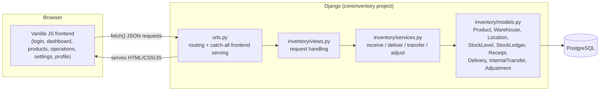
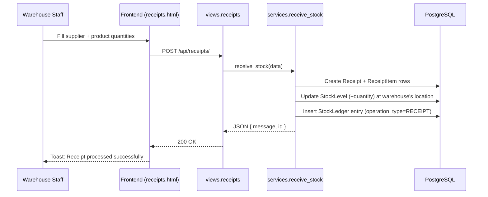

# CoreInventory

A modular Inventory Management System that digitizes stock receipts, deliveries, internal transfers, and adjustments across multiple warehouses.


## Table of Contents

- [Overview](#overview)
- [Problem Statement](#problem-statement)
- [Solution](#solution)
- [Features](#features)
- [Architecture](#architecture)
- [Tech Stack](#tech-stack)
- [Project Structure](#project-structure)
- [System Workflow](#system-workflow)
- [Installation](#installation)
- [Configuration (.env)](#configuration-env)
- [Running Locally](#running-locally)
- [API Documentation](#api-documentation)
- [Author](#author)

## Overview

CoreInventory was built for the Odoo x Indus hackathon. It is a Django backend paired with a vanilla HTML/CSS/JS frontend that models the core operations of a warehouse: products, stock levels, receipts, deliveries, internal transfers, and stock adjustments, all backed by a running ledger of every stock movement.

## Problem Statement

Businesses commonly track inventory through manual registers, spreadsheets, and scattered tools that fall out of sync with the physical stock on hand. CoreInventory replaces that with a centralized, real-time system where:

- Inventory managers can process incoming and outgoing stock.
- Warehouse staff can perform transfers, shelving, and stock counts.
- Every movement, receipt, delivery, transfer, and correction is recorded so stock levels stay auditable.

## Solution

The backend exposes a JSON API for every inventory operation. Each operation (receive, deliver, transfer, adjust) runs inside a single atomic transaction that updates the live `StockLevel` for the affected product/location and appends an entry to the `StockLedger`, so the ledger always reconciles with current stock. The frontend consumes this API directly with `fetch()` and is served by the same Django app.

## Features

| Area | Capability |
|---|---|
| Authentication | Session-based signup, login, logout, and current-user lookup |
| Products | Create, update, delete products with SKU, category, and unit of measure |
| Warehouses & Locations | Multiple warehouses, each with one or more locations; auto-creates a default location per warehouse |
| Receipts | Record incoming stock from a supplier; stock increases automatically on save |
| Deliveries | Record outgoing stock to a customer; blocked if the location doesn't have enough stock |
| Internal Transfers | Move stock between locations, decrementing the source and incrementing the destination |
| Stock Adjustments | Reconcile recorded quantity against a physical count and log the difference |
| Stock Ledger | Full, timestamped history of every stock-affecting operation |
| Dashboard | Live KPIs: total products, low-stock count, pending receipts/deliveries, scheduled transfers, total stock |
| Stock Alerts | Per-product stock status (healthy / low / out) against a minimum threshold |

## Architecture



## Tech Stack

| Layer | Technology |
|---|---|
| Backend framework | Django 6.0.3 (function-based views) |
| Database | PostgreSQL (`psycopg2-binary`) |
| Frontend | HTML5, CSS3, vanilla JavaScript (no framework) |
| Auth | Django session authentication |
| Dev/testing DB | SQLite (via `coreinventory/test_settings.py`) |

## Project Structure

```
odooXindus/
├── coreinventory-backend/
│   ├── coreinventory/            # Django project: settings, urls, wsgi/asgi
│   ├── inventory/                # Django app
│   │   ├── models.py             # Product, Warehouse, Location, StockLevel, StockLedger, Receipt, Delivery, InternalTransfer, Adjustment
│   │   ├── views.py              # API endpoints (auth, products, warehouses, operations, dashboard)
│   │   ├── services.py           # receive_stock / deliver_stock / transfer_stock / adjust_stock (atomic)
│   │   ├── admin.py              # Django admin registrations
│   │   ├── urls.py               # /api/* routes
│   │   ├── migrations/
│   │   └── management/commands/seed_data.py   # demo data seeder
│   ├── frontend/                 # Static frontend served by Django
│   │   ├── login/                # Login, signup, forgot-password
│   │   ├── dashboard/             # KPI dashboard
│   │   ├── products/             # Product catalogue CRUD
│   │   ├── operations/           # Receipts, deliveries, transfers, adjustments, history
│   │   ├── settings/              # Warehouse settings
│   │   ├── profile/              # User profile
│   │   └── shared/               # Shared layout CSS + JS utilities
│   ├── manage.py
│   ├── requirements.txt
│   └── .env.example
├── database/                     # Reference PostgreSQL schema (mirrors the Django models)
│   ├── schema.sql
│   └── 01_enums.sql ... 09_adjustments.sql
├── CoreInventory.pdf             # Hackathon problem statement
└── README.md
```

## System Workflow

Example: processing a stock receipt end to end.



The same pattern (atomic DB transaction + stock update + ledger entry) applies to deliveries, internal transfers, and adjustments in `inventory/services.py`.

## Installation

```bash
git clone https://github.com/KAVYAJOSHI1/odooXindus.git
cd odooXindus/coreinventory-backend
python -m venv venv
venv\Scripts\activate        # Windows
source venv/bin/activate     # macOS/Linux
pip install -r requirements.txt
```

## Configuration (.env)

Copy `.env.example` to `.env` (or export the same variables) before running against PostgreSQL:

| Variable | Purpose | Default (dev) |
|---|---|---|
| `DJANGO_SECRET_KEY` | Django secret key | insecure dev key |
| `DJANGO_DEBUG` | Debug mode | `True` |
| `DJANGO_ALLOWED_HOSTS` | Comma-separated allowed hosts | empty |
| `DB_NAME` | PostgreSQL database name | `coreinventory` |
| `DB_USER` | PostgreSQL user | `coreuser` |
| `DB_PASSWORD` | PostgreSQL password | `password123` |
| `DB_HOST` | PostgreSQL host | `localhost` |
| `DB_PORT` | PostgreSQL port | `5432` |

## Running Locally

```bash
# Apply migrations (PostgreSQL must be running and reachable via your env vars)
python manage.py migrate

# Optional: seed demo warehouses, products, and stock
python manage.py seed_data

# Start the dev server
python manage.py runserver
```

The app is served at `http://127.0.0.1:8000/`, and the same Django server serves both the `/api/*` JSON endpoints and the frontend pages (`index.html` redirects between login and dashboard based on session state).

To run against SQLite instead of PostgreSQL (useful for quick checks or CI):

```bash
python manage.py test inventory --settings=coreinventory.test_settings
```

## API Documentation

All endpoints are rooted at `/api/` and defined in `inventory/urls.py`.

| Method | Endpoint | Description |
|---|---|---|
| POST | `/api/auth/signup/` | Create a user and log in |
| POST | `/api/auth/login/` | Authenticate and start a session |
| GET | `/api/auth/me/` | Return the current session user |
| POST | `/api/auth/logout/` | End the session |
| GET, POST | `/api/products/` | List products (with live stock) / create a product |
| PUT, DELETE | `/api/products/<id>/` | Update or delete a product |
| GET, POST | `/api/warehouses/` | List warehouses / create a warehouse (auto-creates a default location) |
| PUT, DELETE | `/api/warehouses/<id>/` | Update or delete a warehouse |
| GET, POST | `/api/locations/` | List locations / create a location |
| PUT, DELETE | `/api/locations/<id>/` | Update or delete a location |
| GET | `/api/dashboard/` | Dashboard KPIs (totals, low stock, pending documents) |
| GET | `/api/stock-alerts/` | Per-product stock status (healthy / low / out) |
| GET, POST | `/api/receipts/` | List receipts / process an incoming stock receipt |
| GET, POST | `/api/deliveries/` | List deliveries / process an outgoing delivery |
| GET, POST | `/api/transfers/` | List internal transfers / move stock between locations |
| GET, POST | `/api/adjustments/` | List adjustments / reconcile counted vs. recorded stock |
| GET | `/api/history/` | Latest 50 stock ledger entries |

## Author

Built by the CoreInventory team for the Odoo x Indus hackathon.
